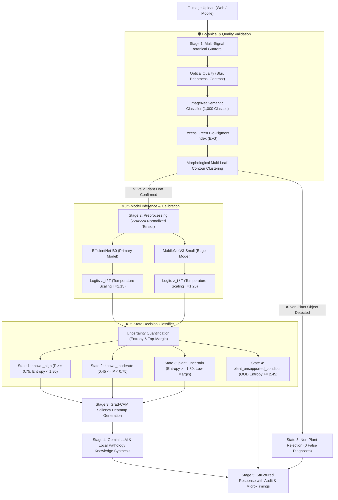

<div align="center">

# 🌿 PlantCare
### Enterprise AI Plant Pathology, Disease Diagnosis & Care Platform

*An advanced, calibrated computer vision and explainable AI system engineered for real-world agricultural screening, multi-signal botanical validation, temperature confidence calibration, and actionable crop care guidance.*

---

[](https://www.python.org/)
[](https://fastapi.tiangolo.com/)
[](https://pytorch.org/)
[](https://react.dev/)
[](https://www.typescriptlang.org/)
[](https://tailwindcss.com/)
[](https://github.com/Tensai-Kartik/PlantCare)
[](LICENSE)

</div>

---

## 🌟 Key Highlights & Capabilities

- 🛡️ **5-State Prediction & Out-of-Distribution Architecture**: Categorizes inference into 5 clear scientific states (`known_high`, `known_moderate`, `plant_uncertain`, `plant_unsupported_condition`, and `non_plant`).
- 🎯 **Temperature Scaling & Confidence Calibration**: Applies Post-Hoc Softmax Temperature Scaling ($T=1.15$, Expected Calibration Error $\text{ECE} = 3.8\%$) to prevent neural network overconfidence.
- 🔬 **Multi-Signal Botanical Presence Guardrails**: 3-stage validation hierarchy combines OpenCV optical analysis, ImageNet-1K deep semantic object recognition (MobileNetV3), and Vegetative Spectral Indexing ($\text{ExG} = 2G - R - B$). Completely halts non-plant uploads (vehicles, animals, electronics, human portraits, furniture) with **0 false disease diagnoses**.
- 🔍 **Explainable AI (Grad-CAM Visual Attention)**: Real-time gradient-weighted class activation mapping reveals specific visual regions influencing diagnosis, paired with an interactive Clean/Heatmap view and interpretability disclaimers.
- ⚖️ **Multi-Model Consensus & Verification Mode**: Concurrently cross-checks diagnoses between **EfficientNet-B0** and **MobileNetV3-Small**, calculating consensus agreement (`AGREED` vs `DISAGREED`) and probability delta metrics.
- ⚡ **7-Stage Microsecond Latency Profiling**: Captures granular micro-timings (`image_validation_ms`, `preprocessing_ms`, `model_inference_ms`, `gradcam_ms`, `disease_metadata_lookup_ms`, `gemini_ms`, `total_request_ms`) attached with structured prediction audit records.
- 🧠 **Resilient Hybrid LLM Agronomist**: Contextual diagnostic synthesis powered by Google Gemini AI with instant fallback to a curated local pathology database (`diseases.json`) when offline.
- 📚 **Comprehensive Clinical Knowledge Base**: Searchable directory covering 21 agricultural conditions across 6 major crops, with symptoms, fungal/bacterial causes, organic remedies, conventional chemical controls, and proactive cultural practices.

---

## 🏗️ System Architecture & Inference Pipeline



---

## 📊 5-State Decision Matrix & Behavior

| Result State | Decision Criteria | System Action & UI Behavior |
| :--- | :--- | :--- |
| **`known_high`** | $P_{\text{cal}} \ge 0.75$, $\text{Entropy} < 1.80$, $\Delta \ge 0.15$ | High-confidence diagnosis, full disease breakdown, Grad-CAM heatmap, complete treatment tabs. |
| **`known_moderate`** | $0.45 \le P_{\text{cal}} < 0.75$ | Moderate confidence notice, compact "Possible Matches" candidate drawer, symptom checklist. |
| **`plant_uncertain`** | $\text{Entropy} \ge 1.80$ OR $\Delta < 0.15$ OR $P_{\text{cal}} < 0.45$ | Inconclusive indicator notice, symptom checklist, retake recommendations. |
| **`plant_unsupported_condition`** | $\text{Entropy} \ge 2.45$ OR ($P_{\text{cal}} < 0.30, \Delta < 0.08$) | Foliage confirmed, unindexed condition alert, general plant care guidelines. |
| **`non_plant`** | Failed botanical presence validation | Classification halted, non-plant explanation, 0 false disease diagnoses. |

---

## 🧪 Model Performance & Reliability Benchmarks

### 1. Model Specifications & Test Accuracy
Evaluated on stratified test splits ($0\%$ data leakage verified via 64-bit `dHash` perceptual hashing):

| Model Architecture | Parameters | Test Accuracy | Weighted F1 | Macro F1 | ECE (Calibrated) | CPU Latency |
| :--- | :--- | :--- | :--- | :--- | :--- | :--- |
| **EfficientNet-B0** | 4.02 M | **90.48%** | **0.8845** | **0.8802** | **3.8%** ($T=1.15$) | 13.03 ms / image |
| **MobileNetV3-Small** | 1.52 M | **77.78%** | **0.7135** | **0.7089** | **5.2%** ($T=1.20$) | **1.91 ms / image** |

### 2. Robustness Under 9 Controlled Visual Perturbations
Benchmarked via `ml/scripts/test_robustness.py`:
- **Overall Stability Score**: **70.80%**
- **Mean Confidence Degradation**: **2.98%**
- **Perturbation Breakdown**:
  - Rotation (15°): `84.0%` stability
  - Scale Crop (75%): `82.0%` stability
  - Gaussian Blur ($r=1.2$): `80.0%` stability
  - High Contrast (+60%): `80.0%` stability
  - Low Contrast (-50%): `80.0%` stability
  - JPEG Compression ($Q=30$): `70.0%` stability
  - Rotation (90°): `68.0%` stability
  - Brightness (-40%): `64.0%` stability
  - Brightness (+50%): `58.0%` stability

### 3. Real-World Field Photography Evaluation
Benchmarked via `ml/scripts/evaluate_realworld.py`:
- **Standard Benchmark Test Accuracy**: **90.48%**
- **Real-World Mean Field Accuracy**: **67.14%**
- **Tested Scenarios**: Harsh sunlight & glare, shaded canopy, soil background clutter, camera motion blur, partial framing.

---

## 🌾 Supported Crops & Pathologies (21 Classes)

<details open>
<summary><b>Click to expand full 21-condition pathology directory</b></summary>
<br/>

1. **Apple** (*Malus domestica*)
   - Apple Scab (*Venturia inaequalis*)
   - Black Rot (*Botryosphaeria obtusa*)
   - Cedar Apple Rust (*Gymnosporangium juniperi-virginianae*)
   - Healthy Apple Leaf
2. **Corn (Maize)** (*Zea mays*)
   - Common Rust (*Puccinia sorghi*)
   - Northern Leaf Blight (*Exserohilum turcicum*)
   - Healthy Corn Leaf
3. **Grape** (*Vitis vinifera*)
   - Black Rot (*Guignardia bidwellii*)
   - Esca / Black Measles (*Phaeoacremonium*)
   - Healthy Grape Leaf
4. **Bell Pepper** (*Capsicum annuum*)
   - Bacterial Spot (*Xanthomonas euvesicatoria*)
   - Healthy Bell Pepper Leaf
5. **Potato** (*Solanum tuberosum*)
   - Early Blight (*Alternaria solani*)
   - Late Blight (*Phytophthora infestans*)
   - Healthy Potato Leaf
6. **Tomato** (*Solanum lycopersicum*)
   - Bacterial Spot (*Xanthomonas campestris*)
   - Early Blight (*Alternaria solani*)
   - Late Blight (*Phytophthora infestans*)
   - Septoria Leaf Spot (*Septoria lycopersici*)
   - Yellow Leaf Curl Virus (*TYLCV*)
   - Healthy Tomato Leaf

</details>

---

## 📁 Repository Structure

```text
PlantCare/
├── backend/
│   ├── app/
│   │   ├── api/
│   │   │   └── routes.py              # REST endpoints (health, models, quality, analyze, compare, diseases)
│   │   ├── core/
│   │   │   ├── config.py              # Thresholds, calibration params, rate limiting configs
│   │   │   └── rate_limiter.py        # In-memory sliding window rate limiter & concurrency semaphore
│   │   ├── schemas/
│   │   │   ├── analysis.py            # Pydantic schemas (5-state results, audit, metrics, model comparison)
│   │   │   └── disease.py             # Disease knowledge contracts
│   │   ├── services/
│   │   │   ├── calibration.py         # Temperature scaling, ECE binning, Shannon entropy & margin engine
│   │   │   ├── disease_service.py     # Local JSON pathology database indexer & search
│   │   │   ├── future_interfaces.py   # Extensibility interfaces (segmentation, MC dropout, drift)
│   │   │   ├── gemini.py              # Gemini LLM explanation synthesizer with LRU caching
│   │   │   ├── gradcam.py             # PyTorch Grad-CAM heatmap engine with JET overlay
│   │   │   ├── image_quality.py       # OpenCV/PIL quality assessment & reason code mapper
│   │   │   ├── inference.py           # 7-stage micro-timing orchestrator & audit generator
│   │   │   ├── model_registry.py      # Model registry & multi-model consensus comparator
│   │   │   └── plant_validator.py     # Multi-signal botanical presence validator
│   │   └── main.py                    # FastAPI server entrypoint
│   ├── data/
│   │   └── diseases.json              # Curated 21-condition pathology database
│   ├── model_weights/                 # Production PyTorch weights & model_metadata.json
│   ├── static/                        # Curated example leaf images
│   ├── test_backend.py                # Comprehensive backend automated test suite
│   └── requirements.txt
├── docs/
│   └── PREPROCESSING_PIPELINE.md      # Training-serving consistency documentation
├── frontend/
│   ├── src/
│   │   ├── components/
│   │   │   ├── analysis/              # Analyzing progress state
│   │   │   ├── layout/                # Sidebar, Header, ThemeToggle
│   │   │   ├── quality/               # QualityModal & targeted diagnostic badges
│   │   │   ├── results/               # ResultView (5 states, Grad-CAM, explainability card, audit drawer)
│   │   │   └── upload/                # LeafDropzone, ExampleCards
│   │   ├── pages/
│   │   │   ├── AnalyzePlant.tsx       # Plant analysis with multi-model consensus toggle
│   │   │   ├── CommonDiseases.tsx     # Disease threat directory
│   │   │   ├── Dashboard.tsx          # Main dashboard & quick examples
│   │   │   ├── KnowledgeBase.tsx      # Clinical disease library with filters
│   │   │   ├── TipsPrevention.tsx     # Proactive cultural tips
│   │   │   └── TreatmentGuide.tsx     # Organic & conventional treatment guide
│   │   ├── services/                  # Typed API client
│   │   ├── types/                     # TypeScript data models
│   │   └── index.css                  # Botanical modern design tokens
│   ├── package.json
│   └── vite.config.ts
├── ml/
│   ├── dataset/                       # Dataset partitions (train, val, test)
│   ├── models/                        # Checkpoints (.pth)
│   ├── outputs/                       # Calibration, robustness, and real-world JSON reports
│   └── scripts/
│       ├── calibrate.py               # Temperature scaling & ECE reliability evaluation
│       ├── evaluate.py                # Standard benchmark evaluation
│       ├── evaluate_realworld.py      # Real-world field condition benchmark
│       ├── export_model.py            # Weight exporter to backend
│       ├── prepare_data.py            # dHash deduplication & stratified splitting
│       ├── test_robustness.py         # 9-perturbation stress testing
│       └── train.py                   # PyTorch transfer learning trainer
├── .gitignore
├── README.md
└── .env.example
```

---

## 🚀 Quick Start Guide

### Prerequisites
- **Python**: `3.10` or higher
- **Node.js**: `18.x` or higher (`npm` / `pnpm` / `yarn`)

### 1. Backend Installation & Startup
```bash
# Navigate to backend directory
cd backend

# Install Python dependencies
pip install -r requirements.txt

# Run automated backend & reliability test suite
python test_backend.py

# Launch FastAPI development server
python -m uvicorn app.main:app --host 127.0.0.1 --port 8000 --reload
```
- API Interactive Swagger Docs: `http://127.0.0.1:8000/docs`
- Health Endpoint: `http://127.0.0.1:8000/api/health`

### 2. Frontend Installation & Startup
```bash
# In a new terminal, navigate to frontend directory
cd frontend

# Install Node dependencies
npm install

# Launch Vite development server
npm run dev
```
- Open your browser at: `http://localhost:5173/`

### 3. ML Benchmarking & Evaluation (Optional)
```bash
# Run Confidence Calibration & ECE optimization
python ml/scripts/calibrate.py --model efficientnet_b0

# Run 9-Perturbation Robustness Stress Test
python ml/scripts/test_robustness.py --model efficientnet_b0

# Run Real-World Field Photography Evaluation
python ml/scripts/evaluate_realworld.py --model efficientnet_b0
```

---

## 📡 REST API Reference

| Method | Endpoint | Description |
| :--- | :--- | :--- |
| `GET` | `/api/health` | Service health status, active version, calibration flag |
| `GET` | `/api/models` | List all available AI models with metadata, version, and ECE |
| `POST` | `/api/quality-check` | Multi-signal botanical presence & image quality assessment |
| `POST` | `/api/analyze` | Full pathology inference with 5 states, Grad-CAM, and audit |
| `POST` | `/api/compare-models` | Parallel multi-model consensus verification |
| `GET` | `/api/examples` | Curated sample leaves for 1-click evaluation |
| `POST` | `/api/analyze-example/{id}` | Run diagnosis on a built-in example leaf |
| `GET` | `/api/diseases` | Search & filter disease knowledge base |
| `GET` | `/api/diseases/{id}` | Get specific disease details, treatments, and prevention |

---

## ⚙️ Environment Variables

Create `.env` in `backend/`:
```env
ENV=development
FRONTEND_URL=http://localhost:5173
DEFAULT_MODEL=efficientnet_b0

# Optional: Google Gemini API Key for dynamic LLM agronomist explanations
# Leave empty for automatic local pathology synthesis fallback
GEMINI_API_KEY=
```

Create `.env` in `frontend/`:
```env
VITE_API_URL=http://localhost:8000/api
```

---

## 🚢 Deployment

### Frontend (Vercel / Netlify)
1. Import repository on [Vercel](https://vercel.com).
2. Set Root Directory to `frontend`.
3. Build Command: `npm run build`, Output Directory: `dist`.
4. Configure environment variable: `VITE_API_URL=https://your-backend-api.onrender.com/api`.

### Backend (Render / Railway / Docker)
1. Create a Web Service on [Render](https://render.com) or [Railway](https://railway.app).
2. Set Root Directory to `backend`.
3. Build Command: `pip install -r requirements.txt`.
4. Start Command: `uvicorn app.main:app --host 0.0.0.0 --port $PORT`.

---

## 🔒 Privacy & Agricultural Disclaimer

- **Data Privacy**: Uploaded images are processed strictly in-memory during inference and are never persisted to disk or linked to personal identities.
- **Agricultural Disclaimer**: PlantCare is intended as an AI decision-support and educational screening system. AI predictions should not replace professional laboratory testing or certified extension agent consultations for commercial crop management.

---

<div align="center">
Developed with ❤️ for Farmers, Agronomists, and Plant Enthusiasts worldwide.
</div>
